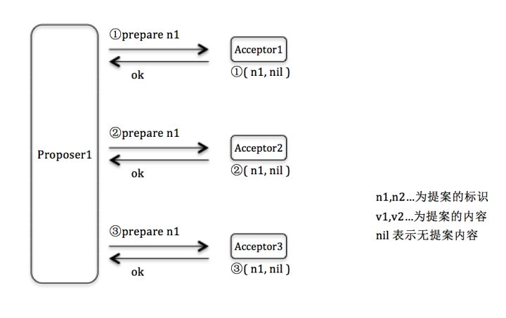
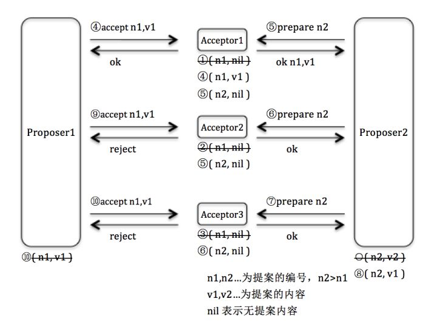
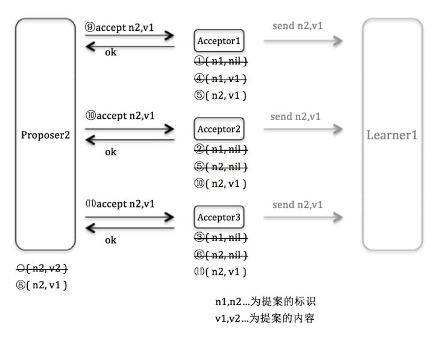
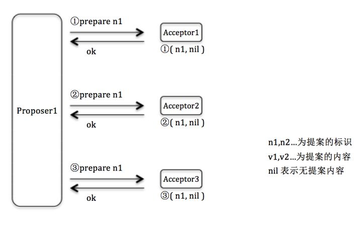
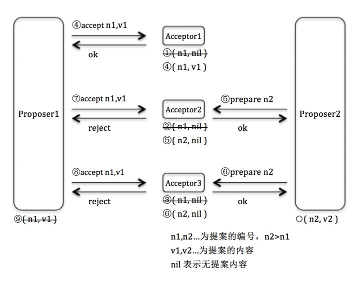
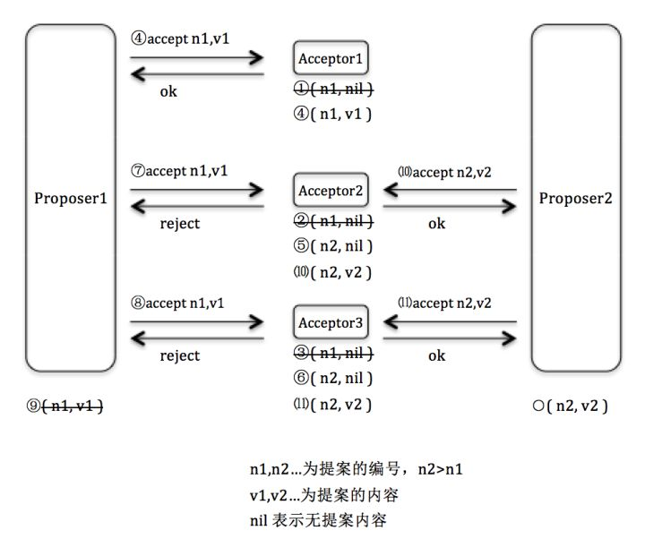
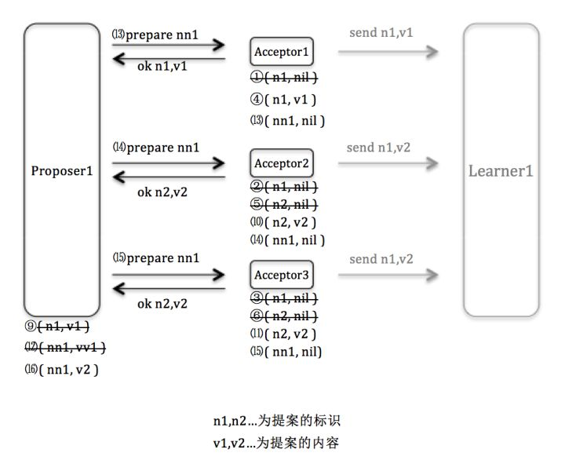

## Assumptions

### roles
paxos算法中的角色有client、acceptor、proposer、learner和leader，每个进程可以有一个或多个角色，通常为了降低延迟一个进程会扮演多个角色。

#### client
client负责向分布式系统发起请求，并等待解锁。

#### acceptor
多个acceptor组成Quorums

#### proposer
proposer接收客户端请求，并向acceptor发起提议。

#### learner

当learner确定一个提案已经被半数以上的acceptor通过，那么它就可以获取到被选定的值
（为什么不由proposer来通知learner，proposer在accept请求被多数派通过后就可以通知learner值已经被选定???）。


#### leader
leader是一个特殊的proposer， paxos协议保证最终只会选择一个proposer作为leader。


### Quorums

Quorums是所有acceptor组成的集合的子集，任何两个Quorum至少有一个成员是相同的，也就是所有accepor中多于半数的成员组成的集合。


## Basic Paxos

### 投票约束

Basic Paxos中一个instance选定一个值，一个paxos instance中可以有多轮投票。投票时满足以下约束：
- 每轮投票的编号必须是唯一的
- 只有多数派进行了投票，本轮投票才算成功
- 对于一轮编号为B<sub>bal</sub>的投票，如果多数派中存在任一成员曾经投过比编号B<sub>bal</sub>小的投票B<sup>'</sup>，
    那么B<sub>dec</sub> = B<sup>'</sup><sub>dec</sub>。 其中B<sub>dec</sub>表示本轮的目标提议。

由投票约束可以导出一致性，即当出现一轮投票B获得多数派的通过，那么不可能再出现一轮投票B<sup>'</sup>，使得
B<sup>'</sup><sub>bal</sub> > B<sub>bal</sub>，而 B<sup>'</sup><sub>dec</sub> ≠ B<sub>dec</sub>

具体的推导参考[朴素Paxos算法理论推导与证明](https://zhuanlan.zhihu.com/p/21438357)

Basic Paxos 的正常情况下的消息流如下
```
Client   Proposer      Acceptor     Learner
   |         |          |  |  |       |  |
   X-------->|          |  |  |       |  |  Request
   |         X--------->|->|->|       |  |  Prepare(1)
   |         |<---------X--X--X       |  |  Promise(1,{Va,Vb,Vc})
   |         X--------->|->|->|       |  |  Accept!(1,Vn)
   |         |<---------X--X--X------>|->|  Accepted(1,Vn)
   |<---------------------------------X--X  Response
   |         |          |  |  |       |  |

Vn = last of (Va,Vb,Vc)  Va,Vb,Vc 中最后达到Proposer的
```


当某个proposer发生故障，另一个proposer接替作为leader发起提议，消息流如下

```
Client  Proposer        Acceptor     Learner
   |      |             |  |  |       |  |
   X----->|             |  |  |       |  |  Request
   |      X------------>|->|->|       |  |  Prepare(1)
   |      |<------------X--X--X       |  |  Promise(1,{null, null, null})
   |      |             |  |  |       |  |
   |      |             |  |  |       |  |  !! Leader fails during broadcast !!
   |      X------------>|  |  |       |  |  Accept!(1,V)
   |      !             |  |  |       |  |
   |         |          |  |  |       |  |  !! NEW LEADER !!
   |         X--------->|->|->|       |  |  Prepare(2)
   |         |<---------X--X--X       |  |  Promise(2,{V, null, null})
   |         X--------->|->|->|       |  |  Accept!(2,V)    忽略null ??? 
   |         |<---------X--X--X------>|->|  Accepted(2,V)
   |<---------------------------------X--X  Response
   |         |          |  |  |       |  |
```


当某个proposer发生故障一段时间后又恢复，此时会有两个proposer同时发起提议，那么可能会一直有冲突
（TODO 如何解决???）

```
Client   Leader         Acceptor     Learner
   |      |             |  |  |       |  |
   X----->|             |  |  |       |  |  Request
   |      X------------>|->|->|       |  |  Prepare(1)
   |      |<------------X--X--X       |  |  Promise(1,{null,null,null})
   |      !             |  |  |       |  |  !! LEADER FAILS
   |         |          |  |  |       |  |  !! NEW LEADER (knows last number was 1)
   |         X--------->|->|->|       |  |  Prepare(2)
   |         |<---------X--X--X       |  |  Promise(2,{null,null,null})
   |      |  |          |  |  |       |  |  !! OLD LEADER recovers
   |      |  |          |  |  |       |  |  !! OLD LEADER tries 2, denied
   |      X------------>|->|->|       |  |  Prepare(2)
   |      |<------------X--X--X       |  |  Nack(2)
   |      |  |          |  |  |       |  |  !! OLD LEADER tries 3
   |      X------------>|->|->|       |  |  Prepare(3)
   |      |<------------X--X--X       |  |  Promise(3,{null,null,null})
   |      |  |          |  |  |       |  |  !! NEW LEADER proposes, denied
   |      |  X--------->|->|->|       |  |  Accept!(2,Va)
   |      |  |<---------X--X--X       |  |  Nack(3)
   |      |  |          |  |  |       |  |  !! NEW LEADER tries 4
   |      |  X--------->|->|->|       |  |  Prepare(4)
   |      |  |<---------X--X--X       |  |  Promise(4,{null,null,null})
   |      |  |          |  |  |       |  |  !! OLD LEADER proposes, denied
   |      X------------>|->|->|       |  |  Accept!(3,Vb)
   |      |<------------X--X--X       |  |  Nack(4)
   |      |  |          |  |  |       |  |  ... and so on ...
```


其他参考
[PAXOS算法的理解](https://zhuanlan.zhihu.com/p/24788205)

其中有两个case需要注意

1. 在Accept阶段发起的新提案接受流程

    - Proposer1提案的Prepare阶段
    
        

    - 在Proposer1的Accept阶段Proposer2提案的Prepare阶段
    
        

    - Proposer2提案的Accept阶段
    
        
    

2. 在Accept阶段向大多数Acceptor发起的新提案接受流程

    - Proposer1提案的Prepare阶段
    
        

    - 在Proposer1的Accept阶段Proposer2向大多数Acceptor提案的Prepare阶段
    
        

    - Proposer2提案的Accept阶段
    
        
     
    - Proposer1重新提案的Prepare阶段
    
        


从两个case中可以看出并不一定是先提议的值被最终选定，paxos算法保证的是被多数派选定的值在一个instance中是不会
被之后的提议被修改。

[Paxos算法原理与推导](http://linbingdong.com/2017/04/17/%E5%88%86%E5%B8%83%E5%BC%8F%E7%B3%BB%E5%88%97%E6%96%87%E7%AB%A0%E2%80%94%E2%80%94Paxos%E7%AE%97%E6%B3%95%E5%8E%9F%E7%90%86%E4%B8%8E%E6%8E%A8%E5%AF%BC/

## Multi Paxos

如果leader proposer很稳定，那么可以一直让该proposer进行提议，这样就可以跳过prepare阶段，大大缩短了时延。
此时在消息中要带上轮数I。

Multi-Paxos中的leader并不刻意通过选举产生，而是当一个节点收到其他节点的Accept请求时（也就是说这个节点在提交提议，并且prepare请求
已经通过），进行一段时间的拒绝提交请求。这样就是有一个节点处于连续的Accept状态，这个节点无形中就处于了Leader状态。


在phxpaxos中并没有实现Leader功能，而是使用master状态机来实现master功能


### Multi-Paxos, start

Multi-Paxos 的起始阶段和Basic Paxos是一样的，信息流为

```
Client   Proposer      Acceptor     Learner
   |         |          |  |  |       |  |
   X-------->|          |  |  |       |  |  Request
   |         X--------->|->|->|       |  |  Prepare(1)
   |         |<---------X--X--X       |  |  Promise(1,{Va,Vb,Vc})
   |         X--------->|->|->|       |  |  Accept!(1,Vn)
   |         |<---------X--X--X------>|->|  Accepted(1,Vn)
   |<---------------------------------X--X  Response
   |         |          |  |  |       |  |

Vn = last of (Va,Vb,Vc)
```

### Multi-Paxos, steady-state

之后同一个leader proposer的paxos instance 可以跳过prepare阶段

```
Client   Proposer       Acceptor     Learner
   |         |          |  |  |       |  |  --- Following Requests ---
   X-------->|          |  |  |       |  |  Request
   |         X--------->|->|->|       |  |  Accept!(N,I+1,W)
   |         |<---------X--X--X------>|->|  Accepted(N,I+1,W)
   |<---------------------------------X--X  Response
   |         |          |  |  |       |  |
```


## phxpaxos

### master机制

[Master选举](https://zhuanlan.zhihu.com/p/21540239)


### 成员变更

[动态成员变更](https://zhuanlan.zhihu.com/p/22148265)

把成员变更作为一个提议交给系统做决议。


### 关于phxpaxos的一些疑问

1. 在phxkv中单发生master切换，如果一个节点还没有learn到之前master最新的数据，那么这个节点有可能成为master吗?
如果有可能的话，那不是会有一小段时间GetGlobal()也获取不到数据。


